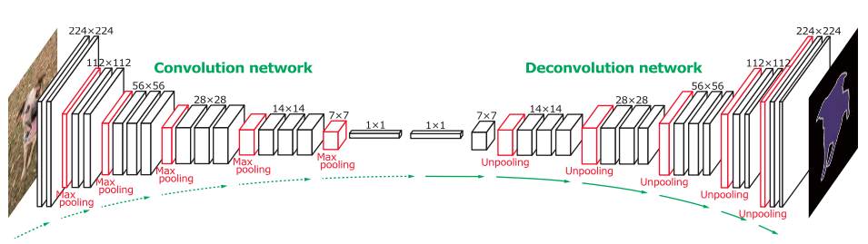
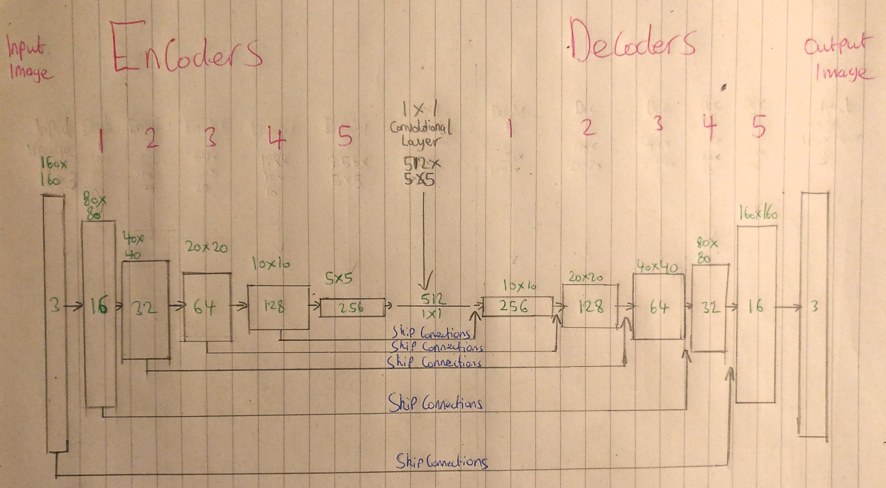
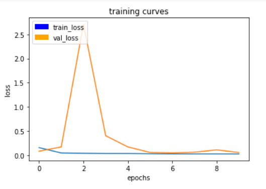
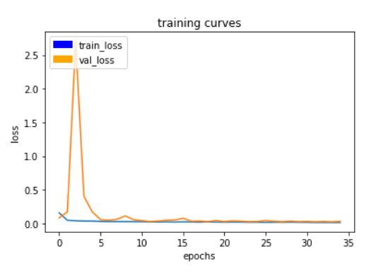
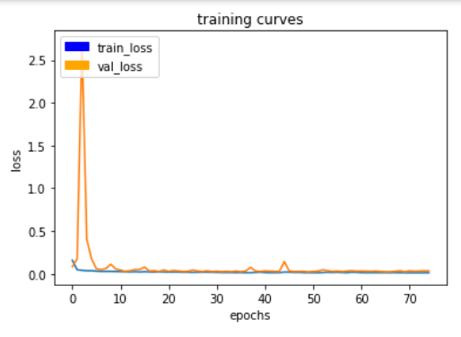
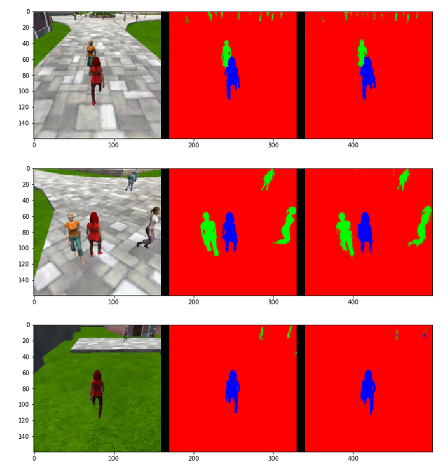
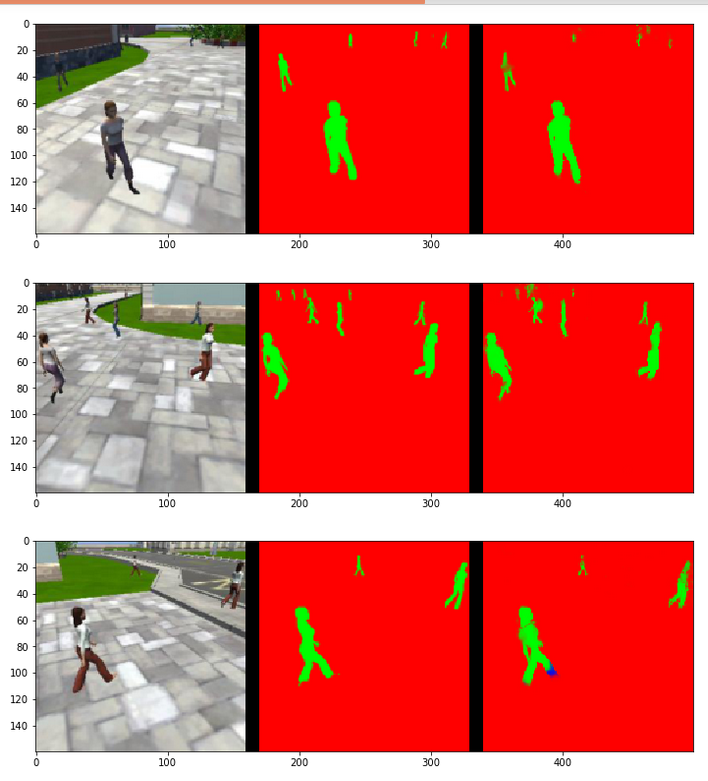
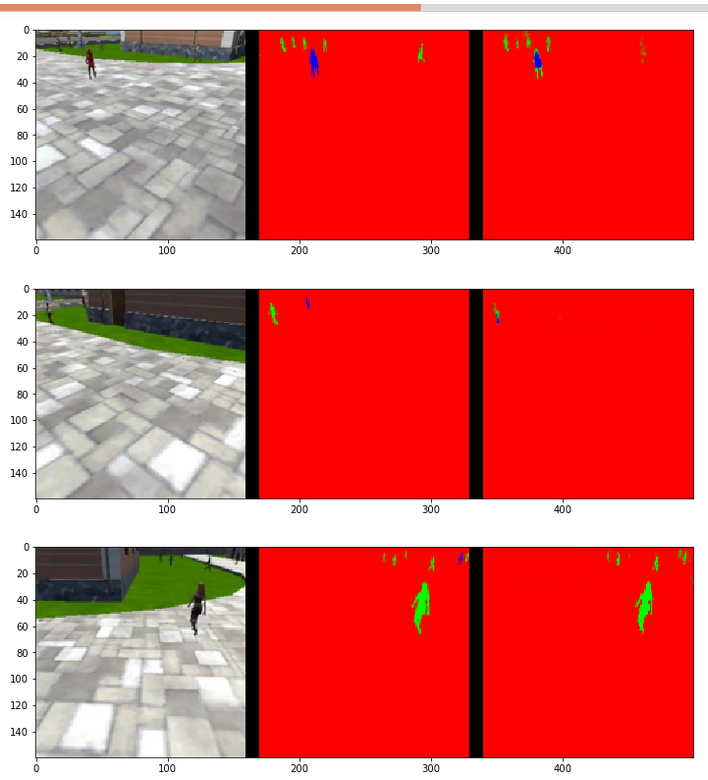

## Follow me project

---

### 1- Introduction:

The model that is used for identifying the target person in the 
quadcopter's input images is a Fully Convolutional Network (FCN). 
An FCN is a type of Convolutional Neural Network (CNN) where the last 
fully connected layer is another 1x1 convolutional layer. This additional
layer has the benefit of adding locational information about the objects
in the scene which is instructive for the quadcopter.

The FCN process flow is understood diagramatically below in Image 1. 
The FCN is split into two parts (convolution or encoder) part which will 
extract features from the image and (deconvolution or decoder) part which
upscales the output of the encoder to the original image size.


#### Image 1- Fully Convolutional Network (FCN)



In summary an FCN is consisting of the following components:

* **Encoder blocks**: these essentially perform a variety of functions including object recognition and downsampling of the input data

* **1x1 Convolution block**: that will reduce the channels of an image and capture the global context of the scene whilst reducing computational cost down the line.

* **Decoder blocks**: this takes the encoded blocks as input and up-samples. By adding previous encoder blocks through skip connections it is possible to recover some of the lost information which improves resolution for segmentation.

* **Softmax activation**: is a  convolution layer takes outputs from the previous decoder block. This indicates the class and location of objects for the output image in a process called semantic segmentation.


### 2- the Network architecture:



The architecture of the project FCN is structured in the same manor as Image 1, with:

- 5 encoders. Each with 8^2n filters
  - Number of strides = 2

- A 1x1 convolutional layer with 512 filters (see Image 2). The 1x1 convolutionl layer has been optmised to double the number of filters     
  which increases the overall final grade result.

- 5 decoders, each with 2 seperable convolutional layers

- A skip connection setup as in Image 2 above


## Project Code:

Following sections will list all used layers along with its python code:

#### Separable convolution layer:

Separable convolution layers in the encoder will each include padding. This includes batch normalization with the ReLU activation function as shown in below code:

```python
def separable_conv2d_batchnorm(input_layer, filters, strides=1):
    output_layer = SeparableConv2DKeras(filters=filters,kernel_size=3, strides=strides,
                             padding='same', activation='relu')(input_layer)
    
    output_layer = layers.BatchNormalization()(output_layer) 
    return output_layer
```

#### Regular Conv layer:

Regular convolution block is used for 1x1 convulation with batch normalization and Relu activation.

```python
def conv2d_batchnorm(input_layer, filters, kernel_size=3, strides=1):
    output_layer = layers.Conv2D(filters=filters, kernel_size=kernel_size, strides=strides, 
                      padding='same', activation='relu')(input_layer)
    
    output_layer = layers.BatchNormalization()(output_layer) 
    return output_layer
```

#### Bilinear Upsampling layer

This is used in the upsampling stage. A value of 2 has been chosen for this project.

```python
def bilinear_upsample(input_layer):
    output_layer = BilinearUpSampling2D((2,2))(input_layer)
    return output_layer
```

#### Encoder Blocks

5 Encoder blocks are used, each encoder block is consisting of one separable convolution layer that is having batch normalization and ReLU activation function.

```python
def encoder_block(input_layer, filters, strides):
    
    # Create a separable convolution layer using the separable_conv2d_batchnorm() function.
    output_layer = separable_conv2d_batchnorm(input_layer, filters, strides)
    
    return output_layer
```

#### Decoder Blocks

5 decoder blocks are used, each decoder block is consisting of Upsampler to collect input from a previous layer with smaller size, a concatenate function to add upsampled layer to the input of decoder then pass the resulting output to two layers of separable conv+batch normalization+ReLU activation function.

```python
def decoder_block(small_ip_layer, large_ip_layer, filters):
    
    # Upsample the small input layer using the bilinear_upsample() function.
    upsampled_small_ip_layer = bilinear_upsample(small_ip_layer)
    
    # Concatenate the upsampled and large input layers using layers.concatenate
    output_layer = layers.concatenate([upsampled_small_ip_layer, large_ip_layer])
    
    # Add some number of separable convolution layers
    output_layer = separable_conv2d_batchnorm( output_layer, filters, strides=1)
    output_layer = separable_conv2d_batchnorm( output_layer, filters, strides=1)
    
    return output_layer
```

#### Softmax activation

Last layer in FCN is regular convolution layer with softmax activation and same padding:

```python
    outputs = layers.Conv2D(num_classes, 1, activation='softmax', padding='same')(layer07)
```
    
#### the FCN model:

Below is the FCN code which combines all functions above

```python
def fcn_model(inputs, num_classes):

    # TODO Add Encoder Blocks.
    # Remember that with each encoder layer, the depth of your model (the number of filters) increases.
    enc1 = encoder_block(inputs, 16, 2)
    enc2 = encoder_block(enc1, 32, 2)
    enc3 = encoder_block(enc2, 64, 2)
    enc4 = encoder_block(enc3, 128, 2)
    enc5 = encoder_block(enc4, 256, 2)
    # TODO Add 1x1 Convolution layer using conv2d_batchnorm().
    con1 = conv2d_batchnorm(enc5, 512, 1, 1)
    # TODO: Add the same number of Decoder Blocks as the number of Encoder Blocks
    dec1 = decoder_block(con1, enc4, 256)
    dec2 = decoder_block(dec1, enc3, 128)
    dec3 = decoder_block(dec2, enc2, 64)
    dec4 = decoder_block(dec3, enc1, 32)
    x    = decoder_block(dec4, inputs, 16)

    # The function returns the output layer of your model. "x" is the final layer obtained from the last decoder_block()
    return layers.Conv2D(num_classes, 1, activation='softmax', padding='same')(x)
```


### 4- HyperParameter(HP) choice:

The code below re-organises the code given in the model_training.ipynb notebook with a method for hyperparameter tuning.  [link](https://www.coursera.org/learn/deep-neural-network)

1- Choose a range for each of the hyper parameters

    generate_random_hyper_parameters(lr_a = -1, lr_b = -4, bs_a = 5, bs_b = 8, num_data=4131)

2- Generate random values for each of the parameters in the ranges defined.

    learning_rate, batch_size, num_epochs, steps_per_epoch, validation_steps, workers = \
    generate_random_hyper_parameters()

3- For the predefined number of iterations, run the parameter values and calculate the final grade
   score.

   # And the final grade score is 
   final_score = final_IoU * weight

4- If the score improves, then save the new parameters. If not continue to the next iteration.

    if final_score > top-final-score:
        top-final-score = final_score

        saved_hyper_parameters['learning_rate']    = learning_rate
        saved_hyper_parameters['batch_size']       = batch_size 
        saved_hyper_parameters['num_epochs']       = num_epochs
        saved_hyper_parameters['steps_per_epoch']  = steps_per_epoch
        saved_hyper_parameters['validation_steps'] = validation_steps
        saved_hyper_parameters['workers']          = workers
        
        print("a new better parameter : {}".format(saved_hyper_parameters))
        
        # Save your trained model weights
        weight_file_name = 'model_weights'
        model_tools.save_network(model, weight_file_name)


#### Final Hyper Parameters (HP)
The output graphs (Images 3-5) of the training curves from each of the 10th, 35th and 75th epoch demonstrate the convergence of the validation loss to the training loss eventually to 0.0115 and 0.0341 respectively

#### Training curves from the 10th epoch


#### Training curves from the 35th epoch


#### Training curves from the 75th epoch

    
Using the data provided in the project repository, the final hyper parameters were found to be:

    # Final results
    learning_rate = 0.015
    batch_size = 32
    num_epochs = 75
    steps_per_epoch = 4131 // 32
    validation_steps = 50
    workers = 4


### 5- Evaluation

The following images shows how the fully convolutional network trained model performed in the three scenarios:

#### Quadcopter following target


    number of validation samples intersection over the union evaulated on 542
    average intersection over union for background is 0.9960960464023674
    average intersection over union for other people is 0.3939160706281827
    average intersection over union for the hero is 0.9278455456674423
    number true positives: 539, number false positives: 0, number false negatives: 0


#### Quadcopter with no target


    number of validation samples intersection over the union evaulated on 270
    average intersection over union for background is 0.9902542985631233
    average intersection over union for other people is 0.8025150949573301
    average intersection over union for the hero is 0.0
    number true positives: 0, number false positives: 39, number false negatives: 0

#### Quadcopter at a long distance from target



    number of validation samples intersection over the union evaulated on 322
    average intersection over union for background is 0.9971313952677134
    average intersection over union for other people is 0.4692958923881602
    average intersection over union for the hero is 0.22198816018696424
    number true positives: 135, number false positives: 0, number false negatives: 166


These predictions resulted in a a weight for the true positives of 0.77, a final IoU of 0.57 and a final grade score of 0.44


### 6- Future Enhancements

1- In order to improve the training and validation losses, a larger data set could be collected simply by inverting the image.

2- As can be seen in Image 8, there are still parts of the target which are missing. This shows that the target is not fully learned and therefore the quadcopter would benefit from greater training sets of the target in order to reduce identification time when in a more complex environment.

3- Adding more layers into the model will help in capturing more contexts and improve accuracy of segmentation.

4- Changing learning rate could reduce learning time

#### Can we use the same model to track other objects?
The same model can be used for a different dataset of other objects; even datasets with different image sizes. However as the model architecture is optmised for the features of a simplified 'human' the level of complexity with which the model is capable of recognising would need to be investigated further.

